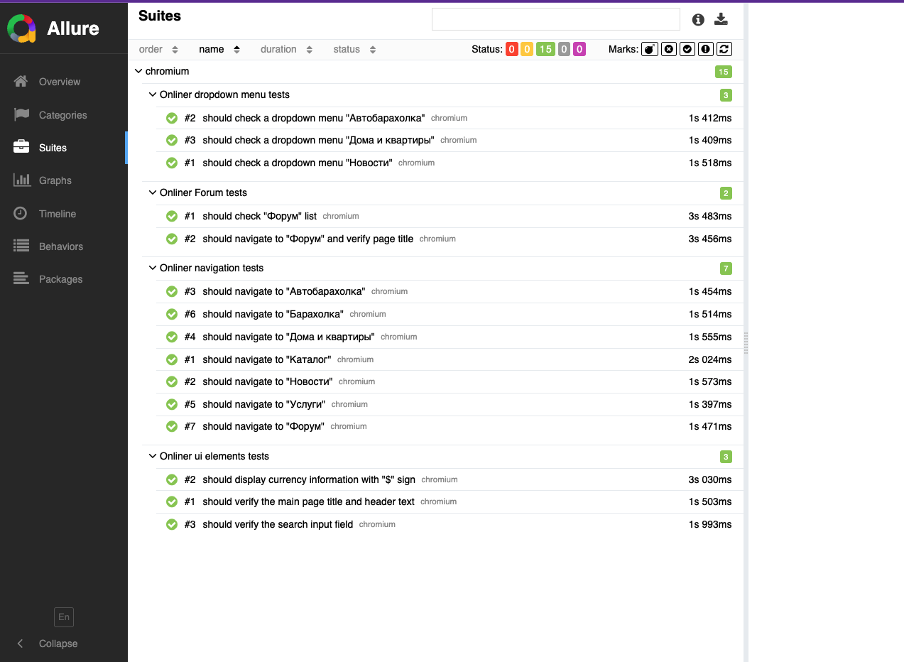

# 🎓 Дипломный проект по автоматизации тестирования  
## **Jest**
## **Jest + superAgent**
## **Playwright + TypeScript**  

  
 


  

Этот проект содержит автотесты, разработанные с использованием **Playwright (TS)** для проверки функциональности интернет-портала [Интернет-портал Onliner](https://www.onliner.by/).  

---

## 📌 Содержание

- [📋 Чек-лист тестов](#cases)  
- [🛠️ Стек технологий](#stack)  
- [⚙️ Подготовка к запуску](#setup)  
- [🚀 Запуск автотестов](#autotests)  
- [📊 Генерация Allure-отчетов](#generateAllureReport)  
- [📑 Пример Allure-отчета](#allureReport)  
- [👤 Автор](#author)

---

<a id="cases"></a>

## 📋 Чек-лист автоматизированных тестов

💻 UI чек-лист:
- Главная страница:
✅ Проверка заголовка и основного текста страницы.
✅ Проверка отображения информации о курсе валют со знаком '$'.
✅ Проверка видимости и доступности поля поиска.
✅ Навигация по основным разделам сайта: "Каталог", "Новости", "Автобарахолка", "Дома и квартиры", "Услуги", "Барахолка", "Форум".
✅ Проверка выпадающих меню (hover):
✅ Меню "Новости": проверка отображения категорий.
✅ Меню "Автобарахолка": проверка отображения категорий.
✅ Меню "Дома и квартиры": проверка отображения категорий. 

- Страница "Форум":
✅ Проверка успешного перехода на страницу "Форум" и её заголовка.
✅ Проверка наличия и видимости основных разделов форума (Important, Technologies, Auto Onliner и др.).
✅ Проверка наличия хотя бы одной темы в списке.

💻 API чек-лист:

GET-запросы:
✅ GET /posts: Проверка получения всех постов.
✅ GET /posts/{id}: Проверка получения конкретного поста по ID.
✅ GET /posts/{id}/comments: Проверка получения комментариев для конкретного поста.
✅ GET /todos: Проверка получения всех задач.
✅ GET /users: Проверка получения всех пользователей.

POST-запросы:
✅ POST /posts: Успешное создание нового поста (статус 201, наличие ID, соответствие отправленных данных).
✅ POST /todos: Успешное создание новой задачи (статус 201, наличие ID, соответствие отправленных данных).
✅ POST /posts: Создание поста без поля body (статус 201, наличие ID, отсутствие body).
✅ POST /posts: Обработка дополнительных полей в теле запроса при создании поста (статус 201, наличие ID и дополнительного поля).
✅ POST /posts: Создание поста с userId в виде строки (статус 201, соответствие userId).

PUT-запросы:
✅ PUT /posts/{id}: Полное обновление существующего поста.
✅ PUT /posts/{id}: Обновление только заголовка поста.
✅ PUT /posts/{id}: Обновление поста с пустым телом запроса.
✅ PUT /todos/{id}: Полное обновление существующей задачи.
✅ PUT /todos/{id}: Обновление только заголовка задачи.

PATCH-запросы:
✅ PATCH /posts/{id}: Частичное обновление заголовка поста (статус 200, соответствие заголовка).
✅ PATCH /posts/{id}: Частичное обновление тела поста (статус 200, соответствие тела).
✅ PATCH /posts/{id}: Частичное обновление поста с пустым телом запроса (статус 200, наличие ID, сохранение остальных полей).
✅ PATCH /todos/{id}: Частичное обновление задачи (статус 200, соответствие обновленного поля completed).
✅ PATCH /todos/{id}: Частичное обновление заголовка задачи (статус 200, соответствие заголовка).

DELETE-запросы:
✅ DELETE /posts/{id}: Успешное удаление существующего поста.
✅ DELETE /todos/{id}: Успешное удаление существующей задачи.
✅ DELETE /posts/{id}: Обработка строкового ID при удалении поста.
✅ DELETE /posts/{id}: Обработка отрицательного ID при удалении поста.

💻 Unit чек-лист:
Позитивные сценарии (Positive Cases):

-Имя пользователя (Username):
✅ Корректная установка и получение валидного имени пользователя.
✅ Корректная установка и получение имени пользователя минимальной длины.
✅ Корректная установка и получение имени пользователя максимальной длины.

-Электронная почта (Email):

✅ Корректная установка и получение валидного email.
✅ Корректная установка и получение email с субдоменом.

-Пароль (Password):

✅ Корректная установка и получение валидного пароля и его подтверждения.

-Возраст (Age):

✅ Корректная установка и получение возраста 18 лет.

✅ Корректная установка и получение среднего возраста (например, 50).

✅ Корректная установка и получение возраста 100 лет.

-Условия (Terms):

✅ Корректная установка и получение согласия с условиями (true).

-Страна (Country):

✅ Корректная установка и получение валидной страны.

-Телефон (Phone Number):

✅ Корректная установка и получение валидного номера телефона.

✅ Корректная установка и получение номера телефона без знака '+'.

-Пол (Gender):

✅ Корректная установка и получение пола 'male'.

✅ Корректная установка и получение пола 'other'.

-Биография (Bio):

✅ Корректная установка и получение пустой биографии.
✅ Корректная установка и получение биографии максимальной длины.

-Валидация формы (isValid):

✅ Метод isValid возвращает true при использовании валидных данных (validUser).
✅ Метод isValid возвращает true при использовании другого набора валидных данных (anotherValidUser).

Негативные сценарии (Negative Cases):

-Имя пользователя (Username):

✅ getUsername выбрасывает исключение для пустого имени пользователя.
✅ getUsername выбрасывает исключение для слишком короткого имени пользователя.
✅ getUsername выбрасывает исключение для слишком длинного имени пользователя.

-Электронная почта (Email):

✅ getEmail выбрасывает исключение для email с неверным форматом.
✅ getEmail выбрасывает исключение для email без символа '@'.

-Пароль (Password):

✅ getPassword выбрасывает исключение для слишком короткого пароля.
✅ getPassword выбрасывает исключение для пароля без заглавных букв, цифр и спецсимволов.

-Подтверждение пароля (Confirm Password):

✅ getConfirmPassword выбрасывает исключение, когда пароли не совпадают.

-Возраст (Age):

✅ getAge выбрасывает исключение для возраста меньше 18 лет.
✅ getAge выбрасывает исключение для нецелочисленного возраста.

-Условия (Terms):

✅ getAcceptTerms выбрасывает исключение, когда условия не приняты (false).

-Страна (Country):

✅ getCountry выбрасывает исключение для пустой строки.

-Телефон (Phone Number):

✅ getPhoneNumber выбрасывает исключение для слишком короткого номера.

-Пол (Gender):

✅ getGender выбрасывает исключение для null значения.
✅ getGender выбрасывает исключение для невалидного значения пола.

-Биография (Bio):

✅ getBio выбрасывает исключение, когда длина биографии превышает максимальную.

-Сценарии с валидацией (isValid):

✅ isValid возвращает false, если установлено невалидное имя пользователя.
✅ isValid возвращает false, если формат email неверный.
✅ isValid возвращает false, если пароль слишком короткий.
✅ isValid возвращает false, если пароли не совпадают.
✅ isValid возвращает false, если возраст меньше 18 лет.
✅ isValid возвращает false, если условия не приняты.
✅ isValid возвращает false, если пол не установлен.

---

<a id="stack"></a>

## 🛠️ Стек технологий

- [Playwright](https://playwright.dev/) – фреймворк для тестирования UI и API
- [Jest](https://jestjs.io/) – фреймворк для юнит- и API-тестирования
- [SuperAgent](https://github.com/ladjs/superagent) – клиент для HTTP-запросов, используется для API-тестирования
- [Node.js](https://nodejs.org/) – среда выполнения JavaScript  
- [Allure Report](https://docs.qameta.io/allure/) – система отчетности  
- [npm](https://www.npmjs.com/) – менеджер пакетов  


---
<a id="setup"></a>

## ⚙️ Подготовка к запуску

1️⃣ Установить Node.js (версия 22+) с [официального сайта](https://nodejs.org/)  
2️⃣ Склонировать проект  
3️⃣ Локально установить все необходимые пакеты

---

<a id="autotests"></a>

## 🚀 Запуск автотестов

Запуск UI тестов
```bash
npm run test:ui
```

Запуск API тестов
```bash
npm run test:api
```

Запуск UNIT тестов
```bash
npm run test:unit
```

---

<a id="generateAllureReport"></a>

## 📊 Генерация Allure отчетов

```bash
npm run test:allure
```

---

<a id="allureReport"></a>

## 📑 Пример Allure отчета 



---

<a id="author"></a>

## 👤 Автор

wviola

